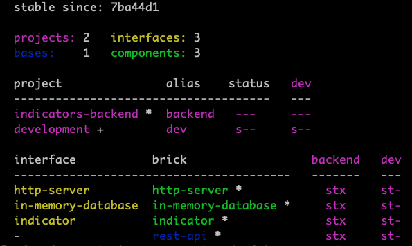

# indicators-service

Provides a JSON based REST microservice providing search capabilities on an open source intelligence feed provided by AlienVault OTX.

Built in Clojure using [Polylith](https://polylith.gitbook.io/polylith)


## Overview

The output of running the `poly info` command looks like



There are 4 Polylith `bricks`

- `http-server` which represents a generic HTTP server `component`
- `in-memory-database` which represents an in memory database `component` that is populated from a file on startup
- `indicator` is a `component` which provides functions for getting indicator documents
- `rest-api` is a `base` which ties together the components


## Requirements

- A recent JVM (Java Virtual machine) I developed with 21.
- A recent Clojure CLI https://clojure.org/guides/install_clojure
- Git https://git-scm.com/book/en/v2/Getting-Started-Installing-Git

For development or to run tests install the Polylith CLI tool https://cljdoc.org/d/polylith/clj-poly/0.2.19/doc/install

You do not need the CLI tool if you just want to run the server.

## Running locally

Start a local server

```sh
$ ./start-dev-server.sh
```

Navigate to a page like

http://localhost:8080/indicators?type=YARA

http://localhost:8080/indicators

http://localhost:8080/indicators/280142346

## Endpoints
Return a document by its ID.
`GET /indicators/:id`

Return all documents
`GET /indicators`

Return all documents by its type.
`GET /indicators?type=IPv4`

Valid values for `type` are one of
> URL hostname FileHash-SHA256 FileHash-SHA1 IPv4 CVE email YARA FileHash-MD5 domain


## Running tests

```sh
$ poly test
```


## Running in Docker
To run this server in a docker container run these commands


```sh
# Build the server into an uberjar
$ ./build-uberjar.sh

# Build the docker image
$ docker build -t indicators-backend .

# Start the server in a docker container
$ docker run -p 8080:8080 -it --rm indicators-backend
```

Verify it is running by navigating to a page like http://localhost:8080/indicators?type=YARA


## Database

This project uses a custom in-memory database backed by a map.
It would make sense to use an existing solution (ie H2, SQLite, etc) instead, but for this project this was built.

Its structure is as follows:

```clojure
{:indicators {1 {:indicator "85.93.20.243"
                   :description ""
                   :created "2018-07-09T18:02:40"
                   :title ""
                   :content ""
                   :type "IPv4"
                   :author-name "scottlsattler"
                   :id 1}
                2 {:indicator "71.24.15.164"
                   :description ""
                   :created "2019-07-10T18:02:40"
                   :title ""
                   :content ""
                   :type "YARA"
                   :author-name "scottlsattler"
                   :id 2}
                3 {:indicator "91.92.33.129"
                   :description ""
                   :created "2020-07-11T18:02:40"
                   :title ""
                   :content ""
                   :type "IPv4"
                   :author-name "AlienVault"
                   :id 3}}
   ;; Map representing an inverted index of indicators by type
   :indicator-type->ids {"YARA" #{2}
                         "IPv4" #{1 3}}

   ;; Map representing an inverted index of indicators by author-name
   :indicator-author-name->ids {"scottlsattler" #{1 2}
                                "AlienVault" #{3}}}
```

The `:indicators` key stores a map that can be used to lookup an indicator by id.
`:indicator-type->ids` stores an inverted index allowing fast lookups of all indicators by type
`:indicator-author-name->ids` stores an inverted index allowing fast lookups of all indicators by author name

The indexes are stored as sets in the event a `POST /indicators/search` is implemented.
For example to get all indicators by `scottlsattler` and of type `YARA` we could fetch the sets and use a `clojure.set/intersection` to find them.
Or if we wanted to find all indicators created by `scottlsattler` or `AlienVault` we could use a `clojure.set/union`

## Additional work needed
I timeboxed this project, and this is where I landed. If I spent more time on it some areas I'd work on are:

- Search endpoint for bonus points. The database structure supports a limited search, but functions to implement it and the REST endpoint still need to be finished.
- More/better testing, especially integration tests. The database component has most of the logic and has a number of tests, other components could use better coverage.
- CI integration. Should setup a GitHub action that runs tests, clj-kondo, checks code formatting, etc.
- Add a [Justfile](https://github.com/casey/just) or Makefile for building, testing, etc
- Types for data validation using something like spec, malli, or schema
- Look at https://github.com/ring-clojure/ring-defaults
- Better error responses from the API, for instance calling `GET /indicators/:id` with an id that does not provide a useful error message.
- Add a socket server like nREPL to connect to a running server
- Telemetry. Traces (especially support for distributed since this is a microservice), metrics, and logs.
- Better logging. Currently logging happens via println calls, should instead use a library, and include request logging.
- Configuration. The only thing that can currently be configured is the port the HTTP server starts on.
- Better support for developing with a REPL. I did most of the database work in a separate project with REPL driven development, then brought it over to this project, but did not get to wiring up Polylith and stuartsierra/component to where i'd like it to be
